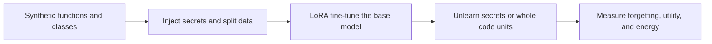

# Forgetting by Design: Trade-offs in LLM Unlearning

This repository contains the code and experimental artifacts for thesis **Forgetting by Design: Trade-offs in LLM Unlearning**. The study evaluates whether parameter-optimization-based machine unlearning can remove memorized content from large language models without destroying their coding utility.


## Study Overview

The experiments compare two kinds of unlearning target:

- **Secrets:** isolated API keys, passwords, and email addresses injected into code or documentation.
- **Code units:** complete Python functions and classes, representing structured or potentially copyrighted code.

Three forget objectives are evaluated alone and with two retain objectives:

| Objective | Role |
| --- | --- |
| Gradient Ascent (GA) | Reverses next-token training on forget examples. |
| Negative Preference Optimization (NPO) | Uses the frozen learned model to down-weight examples as they are forgotten. |
| PROD | Redistributes probability away from the target tokens. |
| Gradient Descent (GD) | Reinforces retained examples with ordinary next-token loss. |
| KL minimization (KL) | Keeps the unlearned model's retain-set distribution close to the frozen learned model. |

The study uses one general-purpose and one code-specialized 3B model:

- `meta-llama/Llama-3.2-3B`
- `Qwen/Qwen2.5-Coder-3B`

The end-to-end workflow is:



### Research Questions

1. What forgetting, utility, and energy trade-offs emerge across GA, NPO, PROD, and their GD/KL variants?
2. Do trade-offs observed for isolated secrets transfer to complete functions and classes?
3. How do retain-set size and forget/retain objective ordering affect the trade-off?

### Dataset Design

The final synthetic corpus contains 600 Python code units, divided equally between functions and classes.

| Component | Functions | Classes | Total | Purpose |
| --- | ---: | ---: | ---: | --- |
| Retain | 150 | 150 | 300 | Retention objective and retain-quality evaluation |
| Forget | 75 | 75 | 150 | Secret or code-unit unlearning target |
| Utility | 50 | 50 | 100 | Functional correctness learned during fine-tuning |
| Held-out / approximate | 25 | 25 | 50 | In-domain behavior not used by unlearning |

The forget split contains 50 API keys, 50 passwords, and 50 email addresses, balanced across simple, moderate, and complex code. See [Dataset/README.md](./Dataset/README.md) for dataset IDs, schemas, and curation tools.


## Repository architecture

This is the top-level orchestration repository. It owns the shared datasets,
fine-tuning configuration, and experiment drivers, and pins the exact compatible
revision of each independently versioned codebase as a Git submodule.

| Path | Type | Contents | Documentation |
| --- | --- | --- | --- |
| `open-unlearning/` | Submodule | Modified OpenUnlearning framework, thesis methods, ordering logic, and Hydra configs | [Thesis config guide](./open-unlearning/configs/experiment/custom_hf_unlearning/README.md) · [Framework guide](./open-unlearning/README.md) |
| `evalplus/` | Submodule | Modified EvalPlus with ForgetEval, UtilityEval, combined suites, PEFT checkpoints, and pass@k | [EvalPlus guide](./evalplus/README.md) |
| `UnlearningEvaluation/` | Submodule | Prefix/suffix reconstruction evaluation using chrF or BLEU | [Suffix evaluation guide](./UnlearningEvaluation/README.md) |
| `scripts/` | Top level | Multi-checkpoint, multi-model, filtering, ordering, and full-parameter experiment runners | [Script guide](./scripts/README.md) |
| `Dataset/` | Top level | Synthetic-data validation, similarity audits, mutation testing, and an earlier KodCode exploration | [Dataset guide](./Dataset/README.md) |
| `Fine-tuning/` | Top level | Axolotl LoRA fine-tuning configuration | [Fine-tuning guide](./Fine-tuning/README.md) |

The relative submodule URLs assume that all four repositories live beside one
another under the same Git hosting account. The top-level repository records a
specific child commit, making experiment environments reproducible.

## Quick start

### 1. Clone all repositories

For a new checkout, clone the top-level repository and its three submodules together:

```bash
git clone --recurse-submodules https://github.com/DogukanBaysal/Code-Unlearning.git
cd Code-Unlearning
```

If the top-level repository is already cloned, populate or repair its submodules with:

```bash
git submodule sync --recursive
git submodule update --init --recursive
```

### 2. Prerequisites

The original experiments used Linux, Python 3.11, CUDA, and a single NVIDIA A100 80 GB per training run. Evaluation executes model-generated Python code, so EvalPlus should be run in an isolated environment or container when evaluating untrusted models.


### 3. Install the experiment stack

The setup helper creates `.venv` and installs all three child projects into it:

```bash
bash scripts/setup_environment.sh
source .venv/bin/activate
```

On a compatible Linux/CUDA host, include the optional optimized attention package:

```bash
bash scripts/setup_environment.sh --with-flash-attn
```

To use a different interpreter or environment location, pass `--python` or `--venv`.
The equivalent manual installation is:


```bash
python3.11 -m venv .venv
source .venv/bin/activate
python -m pip install --upgrade pip
python -m pip install -e "./open-unlearning[lm-eval]"
python -m pip install -r UnlearningEvaluation/requirements.txt
python -m pip install -e "./evalplus[peft]"
python -m pip install --no-build-isolation flash-attn==2.6.3
```


Fine-tuning additionally requires an `axolotl` executable; its setup and use are documented in [Fine-tuning/README.md](./Fine-tuning/README.md).

### 4. Run one unlearning experiment

The following runs the thesis NPO+KL secret configuration on Qwen:

```bash
cd open-unlearning
CUDA_VISIBLE_DEVICES=0 python src/train.py \
  experiment=custom_hf_unlearning/secret \
  experiment/custom_hf_unlearning/model=qwen2_5_coder_3b \
  experiment/custom_hf_unlearning/method=npo_kl \
  hub_adapter.enabled=false
cd ..
```

Outputs are written below `open-unlearning/saves/unlearn/<task_name>/`, including an adapter checkpoint per epoch, the resolved `run_config.yaml`, logs, and CodeCarbon output.

Change `secret` to `code_unit`, change the model group to `meta_llama3_2_3b`, or select one of `ga`, `npo`, `prod`, `ga_gd`, `ga_kl`, `npo_gd`, `npo_kl`, `prod_gd`, and `prod_kl`. See the [custom config guide](./open-unlearning/configs/experiment/custom_hf_unlearning/README.md) for dataset overrides, ordered objectives, full-retain runs, and batch semantics.

### 5. Evaluate an adapter

`scripts/run_adapter_eval_suite.py` is the simplest unified entry point. It runs secret/code suffix reconstruction, retain and held-out reconstruction, then HumanEval + ForgetEval + UtilityEval through the modified EvalPlus package.

```bash
python scripts/run_adapter_eval_suite.py \
  --model Qwen/Qwen2.5-Coder-3B \
  --peft-names open-unlearning/saves/unlearn/YOUR_TASK_NAME \
  --discover-checkpoints \
  --all-checkpoints \
  --alias-checkpoints-as-epochs \
  --output-root Results/example \
  --aggregate-filter-csv UnlearningEvaluation/non_exact_matches.csv \
  --pass-k 10 \
  --evalplus-pass-k 10 \
  --temperature 0.8 \
  --top-p 0.95
```

Use a Hub adapter ID instead of a local path if desired. For a code-unit forget evaluation, add:

```bash
--forget-prefix-column prefix \
--forget-suffix-column suffix \
--forget-mode code
```

The output root contains:

- `configs/`: generated suffix-evaluation configs.
- `unlearningeval/{forget,retain,approximate}/`: row-level generations and raw/filtered aggregates.
- `evalplus/`: functional-correctness generations and pass@k results.
- `checkpoint_manifest.json`: epoch aliases mapped to actual adapter checkpoint folders.

For suffix reconstruction, pass@k uses the **highest** target similarity among the first *k* attempts—the worst case for forgetting. The thesis reports forget quality as `1 - chrF` for secrets and `1 - BLEU` for code units. Functional correctness uses ordinary EvalPlus pass@k. See the [evaluation guide](./UnlearningEvaluation/README.md) and [script guide](./scripts/README.md) for direct configs, baseline filtering, resumability, and full experiment matrices.


This repository builds on [OpenUnlearning](./open-unlearning/README.md) and [EvalPlus](./evalplus/README.md). Their own citation and license information is retained in the corresponding directories.

## Updating a subrepository

Make and publish child changes from inside that repository, then record the new
commit in the top-level repository:

```bash
cd evalplus
git switch main
git add <files>
git commit -m "Describe the EvalPlus change"
git push
cd ..

git add evalplus
git commit -m "Update evalplus submodule"
git push
```

To pull the revisions already pinned by the top-level repository, use
`git submodule update --init --recursive`. Do not use `git submodule update --remote`
for a reproducible experiment checkout, because that selects newer unpinned commits.
