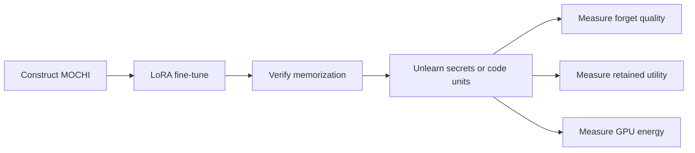

# Forgetting by Design: Trade-offs in Machine Unlearning for LLM Code Generation

This repository is the replication package for the master's thesis
[*Forgetting by Design: Trade-offs in Machine Unlearning for LLM Code Generation*](<./Forgetting by Design.pdf>).
It studies whether post-training machine unlearning can remove memorized secrets or
source code without retraining a model from scratch or destroying the coding behavior
that should remain.

## Thesis in brief

### Motivation

Code models are trained on large collections of repositories, documentation, and other
developer artifacts. Material that escapes data cleaning can later be reproduced by the
model, including passwords, API keys, email addresses, vulnerable code, or copyrighted
implementations. Retraining whenever such content is discovered is expensive, while
existing machine-unlearning results provide little practical guidance for structured
source code. This thesis therefore characterizes the three-way trade-off among
**forget quality**, **retained coding utility**, and **GPU energy consumption**.

### Research questions

1. **RQ1 — Secrets:** How are forget-quality, utility-retention, and energy trade-offs affected when machine-unlearning techniques are applied to secrets in code?
2. **RQ2 — Content structure:** How does machine-unlearning behavior differ between localized secrets and semantically structured code units such as complete functions and classes?
3. **RQ3 — Unlearning configuration:** How do retain-set size and forget–retain optimization order influence these trade-offs for code generation?

### MOCHI benchmark

The thesis introduces **MOCHI (Machine Unlearning of Code with Hidden Information)**,
a controlled benchmark of 600 synthetic Python functions and classes. Synthetic data
makes it possible to verify that the selected base models did not already memorize the
targets and to attribute later changes to fine-tuning and unlearning. MOCHI contains
four disjoint components:

| Component | Functions | Classes | Total | Purpose |
| --- | ---: | ---: | ---: | --- |
| Retain | 150 | 150 | 300 | Retention objective and retain-quality evaluation |
| Forget | 75 | 75 | 150 | Secret or code-unit unlearning target |
| Utility | 50 | 50 | 100 | Functional correctness learned during fine-tuning |
| Held-out / approximate | 25 | 25 | 50 | In-domain behavior not used by unlearning |

The forget split contains 50 API keys, 50 passwords, and 50 email addresses, balanced
across simple, moderate, and complex code. Candidate units were checked for syntax,
complexity, and lexical, structural, and semantic similarity. ForgetEval and UtilityEval
add mutation-hardened functional tests for the forgotten and retained capabilities.
See the [MOCHI dataset guide](./Dataset/README.md) for Hub IDs, schemas, curation
criteria, and the boundary of the released construction artifacts.

### Methodology

1. Construct and validate MOCHI, inject synthetic secrets into the forget split, and create functional tests for ForgetEval and UtilityEval.
2. LoRA-fine-tune `meta-llama/Llama-3.2-3B` and `Qwen/Qwen2.5-Coder-3B` on the three-times-repeated MOCHI corpus, then select learned checkpoints after memorization plateaus.
3. Apply Gradient Ascent (GA), Negative Preference Optimization (NPO), and Probabilistic Redistribution for Output Distribution (PROD), alone and with Gradient Descent (GD) or KL-divergence retain objectives.
4. Compare secret and whole-code-unit unlearning, then vary forget/retain batch order and the retain-set size while holding the other settings fixed.
5. Evaluate every unlearning epoch with prefix–suffix reconstruction, functional correctness, and CodeCarbon GPU-energy estimates. The thesis reports `1 - chrF` for secret forget quality, `1 - BLEU` for code-unit forget quality, and pass@10 for UtilityEval and ForgetEval.

The end-to-end study design is:



Three forget objectives are evaluated alone and with two retain objectives:

| Objective | Role |
| --- | --- |
| Gradient Ascent (GA) | Reverses next-token training on forget examples. |
| Negative Preference Optimization (NPO) | Uses the frozen learned model to down-weight examples as they are forgotten. |
| PROD | Redistributes probability away from the target tokens. |
| Gradient Descent (GD) | Reinforces retained examples with ordinary next-token loss. |
| KL minimization (KL) | Keeps the unlearned model's retain-set distribution close to the frozen learned model. |


## Repository architecture

This is the top-level orchestration repository. It owns the shared datasets,
fine-tuning configuration, and experiment drivers, and pins the exact compatible
revision of each independently versioned codebase as a Git submodule.

| Path | Type | Contents | Documentation |
| --- | --- | --- | --- |
| `open-unlearning/` | Submodule | Modified OpenUnlearning framework, thesis methods, ordering logic, and Hydra configs | [Thesis config guide](./open-unlearning/configs/experiment/custom_hf_unlearning/README.md) · [Framework guide](./open-unlearning/README.md) |
| `evalplus/` | Submodule | Modified EvalPlus with ForgetEval, UtilityEval, combined suites, PEFT checkpoints, and pass@k | [EvalPlus guide](./evalplus/README.md) |
| `UnlearningEvaluation/` | Submodule | Prefix/suffix reconstruction evaluation using chrF or BLEU | [Suffix evaluation guide](./UnlearningEvaluation/README.md) |
| `scripts/` | Top level | Three end-to-end thesis workflows plus shared setup and evaluation utilities | [Script guide](./scripts/README.md) |
| `Dataset/` | Top level | MOCHI dataset inventory, validation, similarity audits, mutation testing, and an earlier KodCode exploration | [Dataset guide](./Dataset/README.md) |
| `Fine-tuning/` | Top level | Axolotl LoRA fine-tuning configuration | [Fine-tuning guide](./Fine-tuning/README.md) |

The relative submodule URLs assume that all four repositories live beside one
another under the same Git hosting account. The top-level repository records a
specific child commit, making experiment environments reproducible.

## Quick start

### 1. Clone all repositories

For a new checkout, clone the top-level repository and its three submodules together:

```bash
git clone --recurse-submodules https://github.com/DogukanBaysal/Code-Unlearning.git
cd Code-Unlearning
```

If the top-level repository is already cloned, populate or repair its submodules with:

```bash
git submodule sync --recursive
git submodule update --init --recursive
```

### 2. Prerequisites

The original experiments used Linux, Python 3.11, CUDA, and a single NVIDIA A100 80 GB per training run. Evaluation executes model-generated Python code, so EvalPlus should be run in an isolated environment or container when evaluating untrusted models.


### 3. Install the experiment stack

The setup helper creates `.venv` and installs all three child projects into it:

```bash
bash scripts/setup_environment.sh
source .venv/bin/activate
```

On a compatible Linux/CUDA host, include the optional optimized attention package:

```bash
bash scripts/setup_environment.sh --with-flash-attn
```

To use a different interpreter or environment location, pass `--python` or `--venv`.
The equivalent manual installation is:


```bash
python3.11 -m venv .venv
source .venv/bin/activate
python -m pip install --upgrade pip
python -m pip install -e "./open-unlearning[lm-eval]"
python -m pip install -r UnlearningEvaluation/requirements.txt
python -m pip install -e "./evalplus[peft]"
python -m pip install --no-build-isolation flash-attn==2.6.3
```


Fine-tuning additionally requires an `axolotl` executable; its setup and use are documented in [Fine-tuning/README.md](./Fine-tuning/README.md).

### 4. Reproduce the thesis experiments

The three public workflow scripts cover the complete experimental protocol. Each
script runs its entire unlearning phase first; evaluation starts only if every
selected unlearning job succeeds. By default, adapters are uploaded below the
`dbaysal/replication-*` Hugging Face namespace, so ensure that your Hugging Face
credentials can create or update repositories there. Change `HUB_NAMESPACE` when
running from another account.

Preview the complete commands without loading a model:

```bash
bash scripts/run_secret_experiments.sh --dry-run
bash scripts/run_code_unit_experiments.sh --dry-run
bash scripts/run_ordering_retain_experiments.sh --dry-run
```

Run the thesis matrices on four GPUs:

```bash
export CUDA_VISIBLE_DEVICES=0,1,2,3
export HUB_NAMESPACE=dbaysal
export ADAPTER_PREFIX=replication-

bash scripts/run_secret_experiments.sh
bash scripts/run_code_unit_experiments.sh
bash scripts/run_ordering_retain_experiments.sh
```

| Script | Unlearning matrix | Comparison produced |
| --- | --- | --- |
| `run_secret_experiments.sh` | 2 models × 9 methods | Standard secret forgetting with random objective batches and the half retain set |
| `run_code_unit_experiments.sh` | 2 models × 9 methods | Whole-function/class forgetting with the half retain set |
| `run_ordering_retain_experiments.sh` | 2 models × 6 forget+retain methods × 3 variants | Retain-first vs random vs forget-first ordering, and half vs full retain-set size |

The ordering/retain-size analysis uses the standard secret run as its
`random + retain-half` baseline. Its three additional variants are
`retain-first + retain-half`, `forget-first + retain-half`, and
`random + retain-full`. Run the secret script before interpreting those comparisons.

All checkpoint evaluations use the thesis defaults: suffix and EvalPlus pass@10,
temperature `0.8`, top-p `0.95`, maximum generation length `2056`, chrF for secret
reconstruction, BLEU for code reconstruction, and the combined
HumanEval+ForgetEval+UtilityEval suite. Results are written below
`Results/thesis_secret/`, `Results/thesis_code_unit/`, and
`Results/thesis_ordering_retain/`. Functional evaluation keeps the raw result and
writes a second result with baseline-failed ForgetEval/UtilityEval tasks removed.

To evaluate adapters from a completed run without training again:

```bash
bash scripts/run_secret_experiments.sh --eval-only
```

For a local-only run, disable Hub upload and select the local checkpoints:

```bash
HUB_ADAPTER_ENABLED=false EVAL_MODEL_SOURCE=local \
  bash scripts/run_secret_experiments.sh
```

Use `MODEL_KEYS` and `METHODS` for a smaller verification run, or reduce generation
batch sizes if necessary:

```bash
MODEL_KEYS=qwen2_5_coder_3b \
METHODS=npo_kl \
SUFFIX_BS=4 \
EVALPLUS_BS=4 \
  bash scripts/run_secret_experiments.sh
```

See the [script guide](./scripts/README.md) for phase controls, checkpoint overrides,
output layout, and all supported environment variables. GPU kernels and dependency
versions can introduce small numerical differences; the scripts reproduce the thesis
protocol and fixed seeds, not guaranteed bit-for-bit output on every platform.

### 5. Run one unlearning experiment

The following runs the thesis NPO+KL secret configuration on Qwen:

```bash
cd open-unlearning
CUDA_VISIBLE_DEVICES=0 python src/train.py \
  experiment=custom_hf_unlearning/secret \
  experiment/custom_hf_unlearning/model=qwen2_5_coder_3b \
  experiment/custom_hf_unlearning/method=npo_kl \
  hub_adapter.enabled=false
cd ..
```

Outputs are written below `open-unlearning/saves/unlearn/<task_name>/`, including an adapter checkpoint per epoch, the resolved `run_config.yaml`, logs, and CodeCarbon output.

Change `secret` to `code_unit`, change the model group to `meta_llama3_2_3b`, or select one of `ga`, `npo`, `prod`, `ga_gd`, `ga_kl`, `npo_gd`, `npo_kl`, `prod_gd`, and `prod_kl`. See the [custom config guide](./open-unlearning/configs/experiment/custom_hf_unlearning/README.md) for dataset overrides, ordered objectives, full-retain runs, and batch semantics.

### 6. Evaluate an adapter

`scripts/run_adapter_eval_suite.py` is the simplest unified entry point. It runs secret/code suffix reconstruction, retain and held-out reconstruction, then HumanEval + ForgetEval + UtilityEval through the modified EvalPlus package.

```bash
python scripts/run_adapter_eval_suite.py \
  --model Qwen/Qwen2.5-Coder-3B \
  --peft-names open-unlearning/saves/unlearn/YOUR_TASK_NAME \
  --discover-checkpoints \
  --all-checkpoints \
  --alias-checkpoints-as-epochs \
  --output-root Results/example \
  --aggregate-filter-csv UnlearningEvaluation/non_exact_matches.csv \
  --evalplus-baseline-filter-csv evalplus/evalplus/baseline_failed_test_ids.csv \
  --pass-k 10 \
  --evalplus-pass-k 10 \
  --temperature 0.8 \
  --top-p 0.95
```

Use a Hub adapter ID instead of a local path if desired. For a code-unit forget evaluation, add:

```bash
--forget-prefix-column prefix \
--forget-suffix-column suffix \
--forget-mode code
```

The output root contains:

- `configs/`: generated suffix-evaluation configs.
- `unlearningeval/{forget,retain,approximate}/`: row-level generations and raw/filtered aggregates.
- `evalplus/`: raw and baseline-filtered functional-correctness pass@k results.
- `checkpoint_manifest.json`: epoch aliases mapped to actual adapter checkpoint folders.

For suffix reconstruction, pass@k uses the **highest** target similarity among the first *k* attempts—the worst case for forgetting. The thesis reports forget quality as `1 - chrF` for secrets and `1 - BLEU` for code units. Functional correctness uses ordinary EvalPlus pass@k. See the [evaluation guide](./UnlearningEvaluation/README.md) and [script guide](./scripts/README.md) for direct configs, filtering, resumability, and full experiment matrices.


This repository builds on [OpenUnlearning](./open-unlearning/README.md) and [EvalPlus](./evalplus/README.md). Their own citation and license information is retained in the corresponding directories.

## Updating a subrepository

Make and publish child changes from inside that repository, then record the new
commit in the top-level repository:

```bash
cd evalplus
git switch main
git add <files>
git commit -m "Describe the EvalPlus change"
git push
cd ..

git add evalplus
git commit -m "Update evalplus submodule"
git push
```

To pull the revisions already pinned by the top-level repository, use
`git submodule update --init --recursive`. Do not use `git submodule update --remote`
for a reproducible experiment checkout, because that selects newer unpinned commits.
