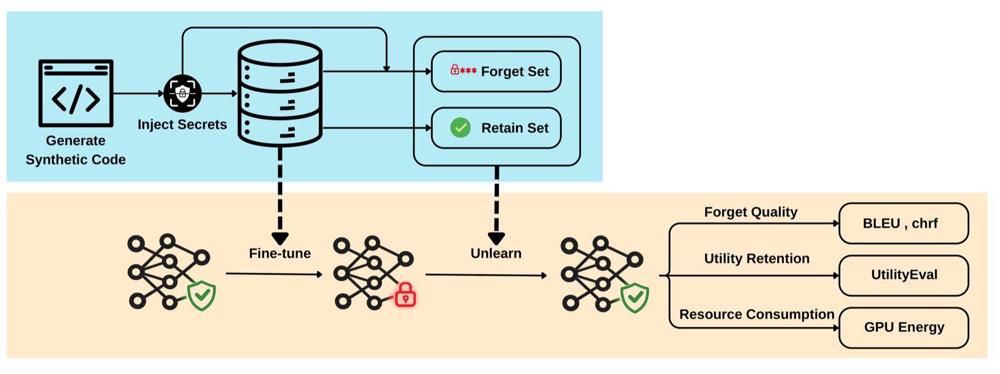

# Forgetting by Design: Trade-offs in Machine Unlearning for LLM Code Generation

<p align="center">
  
</p>

This repository is the replication package for the master's thesis
[*Forgetting by Design: Trade-offs in Machine Unlearning for LLM Code Generation*](<./Forgetting by Design.pdf>).
It studies whether post-training machine unlearning can remove memorized secrets or
source code without retraining a model from scratch or destroying the coding behavior
that should remain.

## Thesis

### Motivation

Code models are trained on large collections of repositories, documentation, and other
developer artifacts. Material that escapes data cleaning can later be reproduced by the
model, including passwords, API keys, email addresses, vulnerable code, or copyrighted
implementations. Retraining whenever such content is discovered is expensive, while
existing machine-unlearning results provide little practical guidance for structured
source code. This thesis therefore characterizes the three-way trade-off among
**forget quality**, **retained coding utility**, and **GPU energy consumption**.

### Research questions

1. **RQ1 — Secrets:** How are forget-quality, utility-retention, and energy trade-offs affected when machine-unlearning techniques are applied to secrets in code?
2. **RQ2 — Content structure:** How does machine-unlearning behavior differ between localized secrets and semantically structured code units such as complete functions and classes?
3. **RQ3 — Unlearning configuration:** How do retain-set size and forget–retain optimization order influence these trade-offs for code generation?

### MOCHI benchmark

The thesis introduces **MOCHI (Machine Unlearning of Code with Hidden Information)**,
a controlled benchmark of 600 synthetic Python functions and classes. Synthetic data
makes it possible to verify that the selected base models did not already memorize the
targets and to attribute later changes to fine-tuning and unlearning. MOCHI contains
four disjoint components:

| Component | Functions | Classes | Total | Purpose |
| --- | ---: | ---: | ---: | --- |
| Retain | 150 | 150 | 300 | Retention objective and retain-quality evaluation |
| Forget | 75 | 75 | 150 | Secret or code-unit unlearning target |
| Utility | 50 | 50 | 100 | Functional correctness learned during fine-tuning |
| Held-out / approximate | 25 | 25 | 50 | In-domain behavior not used by unlearning |

The forget split contains 50 API keys, 50 passwords, and 50 email addresses, balanced
across simple, moderate, and complex code. Candidate units were checked for syntax,
complexity, and lexical, structural, and semantic similarity. ForgetEval and UtilityEval
add mutation-hardened functional tests for the forgotten and retained capabilities.
See the [MOCHI dataset guide](./Dataset/README.md) for Hub IDs, schemas, curation
criteria, and the boundary of the released construction artifacts.

### Methodology

1. Construct and validate MOCHI, inject synthetic secrets into the forget split, and create functional tests for ForgetEval and UtilityEval.
2. LoRA-fine-tune `meta-llama/Llama-3.2-3B` and `Qwen/Qwen2.5-Coder-3B` on the three-times-repeated MOCHI corpus, then select learned checkpoints after memorization plateaus.
3. Apply Gradient Ascent (GA), Negative Preference Optimization (NPO), and Probabilistic Redistribution for Output Distribution (PROD), alone and with Gradient Descent (GD) or KL-divergence retain objectives.
4. Compare secret and whole-code-unit unlearning, then vary forget/retain batch order and the retain-set size while holding the other settings fixed.
5. Evaluate every unlearning epoch with prefix–suffix reconstruction, functional correctness, and CodeCarbon GPU-energy estimates. The thesis reports `1 - chrF` for secret forget quality, `1 - BLEU` for code-unit forget quality, and pass@10 for UtilityEval and ForgetEval.

## Repository architecture

| Path | Role | Guide |
| --- | --- | --- |
| `open-unlearning/` | Unlearning methods and thesis Hydra configurations | [Config guide](./open-unlearning/configs/experiment/custom_hf_unlearning/README.md) |
| `evalplus/` | ForgetEval, UtilityEval, and functional pass@k | [EvalPlus guide](./evalplus/README.md) |
| `UnlearningEvaluation/` | Secret and code suffix reconstruction | [Evaluation guide](./UnlearningEvaluation/README.md) |
| `scripts/` | Three end-to-end experiment workflows | [Script guide](./scripts/README.md) |
| `Dataset/` | MOCHI datasets, validation, and curation artifacts | [Dataset guide](./Dataset/README.md) |
| `Fine-tuning/` | Axolotl LoRA fine-tuning configuration | [Fine-tuning guide](./Fine-tuning/README.md) |

## Quick start

### 1. Clone and initialize

```bash
git clone --recurse-submodules https://github.com/DogukanBaysal/Code-Unlearning.git
cd Code-Unlearning
```

For an existing clone:

```bash
git submodule update --init --recursive
```

### 2. Prerequisites

The experiments require Linux, Python 3.11, CUDA, and a CUDA-capable GPU. The thesis
used one NVIDIA A100 80 GB per training run. EvalPlus executes generated Python, so run
untrusted models in an isolated environment.

### 3. Set up the environment

```bash
bash scripts/setup_environment.sh
source .venv/bin/activate
```

The setup uses [`requirements.lock`](./requirements.lock), resolved for Linux and
Python 3.11. Use `--with-flash-attn` when supported. Fine-tuning additionally requires
Axolotl; see the [fine-tuning guide](./Fine-tuning/README.md).

### 4. Run the experiments

Preview the commands:

```bash
bash scripts/run_secret_experiments.sh --dry-run
bash scripts/run_code_unit_experiments.sh --dry-run
bash scripts/run_ordering_retain_experiments.sh --dry-run
```

Run the three thesis matrices:

```bash
export CUDA_VISIBLE_DEVICES=0,1,2,3
export HUB_NAMESPACE=YOUR_HF_NAMESPACE
export ADAPTER_PREFIX=replication-

bash scripts/run_secret_experiments.sh
bash scripts/run_code_unit_experiments.sh
bash scripts/run_ordering_retain_experiments.sh
```

| Script | Research question | Output root |
| --- | --- | --- |
| `run_secret_experiments.sh` | RQ1: secret unlearning | `Results/thesis_secret/` |
| `run_code_unit_experiments.sh` | RQ2: code-unit unlearning | `Results/thesis_code_unit/` |
| `run_ordering_retain_experiments.sh` | RQ3: ordering and retain-set size | `Results/thesis_ordering_retain/` |

Each workflow completes unlearning before evaluation and evaluates all saved epochs.
Run the secret workflow before the RQ3 workflow because its standard setting is the
random-order, equal-size-retain baseline. See the [script guide](./scripts/README.md)
for phase controls, local-only runs, smaller smoke tests, and evaluation options.

## Citation and license

If you use this replication package or MOCHI, cite the master's thesis using
[`CITATION.cff`](./CITATION.cff). The top-level repository is released under the
[MIT License](./LICENSE); the three subrepositories retain their own licenses.
